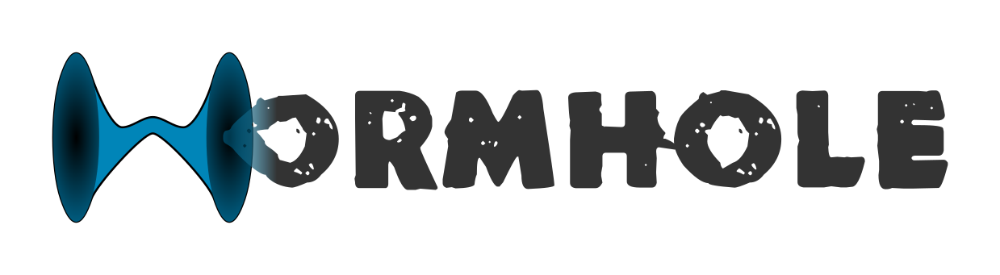

> :warning: **Not production ready**: Wormhole is currently a concept library with uncertain future. API changes rapidly. Stability is not guaranteed. 



[](https://www.patreon.com/bePatron?u=5743048)

http://flutter-wormhole.tk/become-a-patron-button-1.png

REST API data replication layer.

Wormhole loads data from any REST API service into your app and synchronizes data changes made in your app back to the REST API service. All automatic and customizable.

Just define the protocol and enjoy:
- Automatic data retrieval on demand.
- Optional periodic data refresh to reflect current data.
- Working with retrieved data the same way you would work with regular Dart `List`s and `Map`s.
- Automatic data creation (`POST`), update (`PUT`) and removal (`DELETE`) requests to the corresponding API service upon editing the locally held data copy.
- Provider compatibility.
- Support for user accounts and roles.
- Full endpoint and data processing customization.
- Working simultaneously with multiple REST API services.
- Server-less development with example data.
- API reference export to HTML or JSON for your server side dev.
- Offline apps with local data cache.


# Intro sample

Imagine you want to display a list of all countries of the world in your app. We'll use [this REST API endpoint](https://restcountries.eu/rest/v2/all) for that, which will give us a response in the following format:

```json
[
  {
    "name": "Country name",
  },
]
```

The code you need to display the list of countries is:

```dart
import 'package:flutter/material.dart';
import 'package:provider/provider.dart';
import 'package:wormhole/wormhole.dart';

void main() {
  Store().setupProtocol();
  Store().bootstrap();
  runApp(MyApp());
}

class MyApp extends StatelessWidget {
  @override
  Widget build(BuildContext context) {
    return ChangeNotifierProvider<Store>.value(
      value: Store(),
      child: MaterialApp(
        title: 'Wormhole Demo',
        theme: ThemeData(
          primarySwatch: Colors.blue,
          visualDensity: VisualDensity.adaptivePlatformDensity,
        ),
        home: CountriesScreen()
      )
    );
  }
}

class CountriesScreen extends StatelessWidget {
  @override
  Widget build(BuildContext context) {
    Store provider = Provider.of<Store>(context);

    return Scaffold(
      body: (provider.countries.length > 0) ? ListView.builder(
        itemCount: provider.countries.length,
        itemBuilder: (BuildContext context, int index) {
          return Card(
            child: Text(provider.countries.list[index]['name'])
          );
        }
      ) :
      Center(
        child: CircularProgressIndicator(),
      ),
    );
  }
}

//
// This is a sort of fusion of Wormhole and Provider.
// While Wormhole automatically loads and synchronizes
// data between the app and the server, Provider takes
// care of automatically reflecting data in your app.
// The magic happens behind the scenes, you can focus
// on building your UI.
//

class Store with ChangeNotifier {
  WCollection countries;

  // Just define the REST API protocol, Wormhole handles the rest.
  void setupProtocol() {
    Wormhole()['countries-api'] = WRestApi(base: 'https://restcountries.eu/rest/v2/');

    // this translates into https://restcountries.eu/rest/v2/all
    Wormhole()['countries-api']['all'] = WCollection(
      fields: [
        WID<String>('name'),
      ]
    );

    Wormhole().setup();
  }

  void bootstrap() {
    countries = Wormhole()['countries-api']['all'] & notifyListeners;
  }
  
  // Singleton
  static final Store _singleton = Store._internal();
  factory Store() => _singleton;
  Store._internal();
}

```

Try this sample on your own. Just create a new Flutter project, replace the code in `main.dart` with the code above and add dependencies to the `pubspec.yaml` file:

```yaml
dependencies:
  flutter:
    sdk: flutter
  provider:
  wormhole:
```

Also, please don't forget to use these dependencies with any of the below examples.


# How it works

Although you can customize endpoint URIs, HTTP methods, access conditions or event the way data is handled, by default Wormhole expects your API to be in the following format.

First, There's always a base URL for an API and the rest is a collection name. For example an app where people post their statuses (Twitter / Facebook like app) would have the following base URL:
```
https://YourRestService/v1/
```

Everything after the base URL would be collections, for example:
```
https://YourRestService/v1/posts
```

By default, Wormhole assumes the following endpoints are available for a collection:

- `GET https://YourRestService/v1/posts` responds with a complete list of posts. (`list` operation)
- `GET https://YourRestService/v1/posts/<id>` responds with a single post. (`read` operation)
- `GET https://YourRestService/v1/posts/mine` responds with a list of posts created by the currently logged in user. (`mine` operation)
- `POST https://YourRestService/v1/posts` creates a new post. (`create` operation)
- `PUT https://YourRestService/v1/posts/<id>` edits an existing post. (`update` operation)
- `DELETE https://YourRestService/v1/posts/<id>` deletes an existing post. (`delete` operation)

In Wormhole, the definition of such a protocol would look like this (`lib/protocol.dart`):
```dart
import 'dart:core';
import 'package:wormhole/wormhole.dart';

// This function is to be called at the very beginning of your app.
setupProtocols() {

  // Create an API definition. Because we can work with multiple
  // APIs simultaneously, we need to give each API an identifier,
  // which is `main` API in this case.
  Wormhole()['main'] = WRestApi(
    base: 'https://YourRestService/v1/',
    // comments are useful for exporting API reference
    comment: 'Posts App API',
  );

  // User posts definition
  Wormhole()['main']['posts'] = WCollection(
    comment: 'User posts.',
    fields: [
      WID<int>('id'),
      WField<String>('content'),
      WCreated<int>('created', comment: 'Creation timestamp (seconds).'),
      WCreated<int>('updated', comment: 'Last update timestamp (seconds).'),
    ],
  );

  Wormhole().setup();
} 
```

Once defined, we can use any collection just as regular a regular `List<Map>` in our app. Let's say we'll create a class called `Store` to hold our data:

```dart
import 'dart:async';
import 'package:wormhole/wormhole.dart';

import 'protocol.dart';

class Store  {
  WCollection posts;

  void bootstrap() async {
    setupProtocols();
    posts = Wormhole()['main']['posts'];
  }
  
  // Singleton
  static final Store _singleton = Store._internal();
  factory Store() => _singleton;
  Store._internal();
}

```

We can now call any regular `List<Map>` operations on `Store().posts`. For example, to add a new post, we can call:
```dart
Store().posts.add({
  content: 'My first post!'
  // id, created and updated can be omitted here
});
```

The above call will not only add the data to the Wormhole's local copy, but also will make a `POST https://YourRestService/v1/posts` request with the `content` parameter in the request body.

To achieve the ultimate zen mode, combine Wormhole with Provider:
```dart
import 'package:flutter/material.dart';
import 'package:provider/provider.dart';
import 'package:wormhole/wormhole.dart';

import 'protocol.dart';

class Store with ChangeNotifier {
  WCollection posts;

  void bootstrap() async {
    setupProtocols();
    // `& notifyListeners` makes Wormhole call notifyListeners() upon every
    // change to the local data copy 
    posts = Wormhole()['main']['posts'] & notifyListeners;
  }
  
  // Singleton
  static final Store _singleton = Store._internal();
  factory Store() => _singleton;
  Store._internal();
}
```

You can now use provider to reflect any data change in the list of posts in your UI:
```dart
import 'package:flutter/material.dart';
import 'package:provider/provider.dart';
import 'package:wormhole/wormhole.dart';

void main() {
  Store().bootstrap();
  runApp(MyApp());
}

class MyApp extends StatelessWidget {
  @override
  Widget build(BuildContext context) {
    // notice we are using ChangeNotifierProvider parent to our entire app,
    // so changes in data trigger rebuilding the UI
    return ChangeNotifierProvider<Store>.value(
      value: Store(),
      child: MaterialApp(
        title: 'Wormhole Demo',
        theme: ThemeData(
          primarySwatch: Colors.blue,
          visualDensity: VisualDensity.adaptivePlatformDensity,
        ),
        home: PostsScreen()
      )
    );
  }
}

class PostsScreen extends StatelessWidget {
  @override
  Widget build(BuildContext context) {
    Store provider = Provider.of<Store>(context);

    return Scaffold(
      body: (provider.posts.length > 0) ? ListView.builder(
        itemCount: provider.posts.length,
        itemBuilder: (BuildContext context, int index) {
          return Card(
            child: Text(provider.posts.list[index]['content'])
          );
        }
      ) :
      Center(
        child: CircularProgressIndicator(),
      ),
    );
  }
}
```


# Protocol definition

All the code in this section does not provide any pratical functionality to your app. It only tells Wormhole how to behave and also how the API services you are using should behave.

Once you define your protocols, Wormhole does the rest of the job with very little of further attention.

You can also use the protocol definition for server side development.

## Define a REST API service

```dart
Wormhole()['main'] = WRestApi(
  base: 'https://YourRestService/v1/',
);

// Collection definitions here

Wormhole().setup();
```

## Define a simple collection

```dart
Wormhole()['main']['posts'] = WCollection(
  comment: 'User posts.',
  fields: [
    WID<int>('id'),
    WField<String>('content'),
    WCreated<int>('created', comment: 'Creation timestamp (seconds).'),
    WCreated<int>('updated', comment: 'Last update timestamp (seconds).'),
  ],
);
```


## Disable a collection operation

```dart
// Define that deletion of a post is not available
Wormhole()['main']['posts'].disable('delete');
```

`disable()` accepts a `String` representing any of the operations available on each collection: `list`, `read`, `mine`, `create`, `update`, `delete`.

## Define a required endpoint parameter / argument

## Restrict a collection operation to a user role

```dart
// Define that deletion of a post is only available to user with the `admin` role
Wormhole()['main']['posts'].override('delete').roles = ['admin'];
```

`override()` accepts a `String` representing any of the operations available on each collection: `list`, `read`, `mine`, `create`, `update`, `delete`.

## Change the HTTP method of an endpoint
```dart
// Define that editing a post should be requested with the HTTP `POST`
// method instead of the default `PUT`
Wormhole()['main']['posts'].override('update').method = WHttpMethod.POST;
```

`override()` accepts a `String` representing any of the operations available on each collection: `list`, `read`, `mine`, `create`, `update`, `delete`.

## Add a custom endpoint to a collection

## Define a special collection: user accounts

There's a special type of collection for user accounts with additional features: `WAccountCollection`

```dart
Wormhole()['main']['users'] = WAccountCollection(
  comment: 'User accounts.',
  fields: [
    // In a `WAccountCollection`, the `WID` and `WAccountId`
    // field values are always identical.
    WID<int>('id'), // always required
    WAccountId<int>('user_id'), // always required
    WField<String>('name'), // optional example
    WField<String>('banned'), // optional example
    WField<String>('lang'), // optional example
    WField<List>('roles'), // always required
    // created is the user's registration date
    WCreated<int>('created', comment: 'Creation timestamp (seconds).'),
  ],
  // This will be used for the current user on application startup,
  // before the user logs in
  defaultData: [
    {
      'roles': [],
      'lang': 'en',
    }
  ]
);

//
// Customization
//

// get collection reference
WCollection users = Wormhole()['main']['users'];

// only admins will be able to list all users
users.override('list').roles = ['admin'];

// reading a single user will require the `id` parameter
users.override('read').args = [ WArg<WField, String>('id', require: true) ];
// reading a single user will require the `admin` role
users.override('read').roles = ['admin'];

// reading a single user will require the `id` parameter
users.override('update').args = [ WArg<WField, String>('id', require: true) ];
// modifying a single user will require the `admin` role
users.override('update').roles = ['admin'];
// special condition your server dev should implement:
users.override('update').comment += ' The admin role is required only if the request is attempting to update an account other than the user\'s own.';

// deleting a single user will require the `id` parameter
users.override('delete').args = [ WArg<WField, String>('id', require: true) ];
// deleting a single user will require the `admin` role
users.override('delete').roles = ['admin'];
// special condition your server dev should implement:
users.override('delete').comment += ' The admin role is required only if the request is attempting to delete an account other than the user\'s own.';
// (if you wish so, normally it is never a good idea to completely
// delete user accounts and setting `banned` to a positive value
// is recommended instead)
```

## Apply user's authentication data in Wormhole

`WAccountCollection` comes with a special operation `sign-in`, which happens upon user's log in / sign in.

```dart
Wormhole()['main']['users'] = WAccountCollection( /* ... */ );

WCollection users = Wormhole()['main']['users'];

users.override('sign-in').handler = (context, response) {
  // Here we are passing the user's Id and auth token to Wormhole
  context.api.authToken = response.data.token;
  context.api.accountId = response.data.id;
};
```

The value of `context.api.authToken` is then sent with every request to the given service API as the authorization HTTP header: `Authorization: Bearer <value>`

## Apply protocol definitions

When you are done defining your API protocols, simply call `Wormhole().setup();` after all the definition lines.

## Comment an endpoint

## Comment a collection

## Comment a field

The parameters `comment`, `regex` and `example` are available to better specify what values are expected in a parameter, for example:

```dart
WField<int>('risk', 
  comment: 'Indicator of risk on a scale 1-3. 1=Verified, 2=Similar to verified, 3=Experimental',
  regex: '^[1-3]\$',
  example: 1,
)
```

# Using Wormhole

## Periodically refresh a collection's data

When defining collections, use the `refreshInterval` parameter. Wormhole will automatically pull data once per specified interval in seconds.

```dart
WCollection(
  refreshInterval: 3600, // seconds
  // ...
)
```

## Users: Log in / Sign in

## Users: Initiate password recovery

## Users: Recover password

## Develop your app before the server side is ready

You've been there. You are about to pull a new project and you would like to start building the UI, but that's not easy without having a working server side to give you some data to display.

And it will take you (or the other dev) at least a few days to get the server side to a usable state.

No worries, just add `defaultData` to any of your collections. Wormhole will still try to load data from the specified API address, but will fall back to `defaultData` if unsuccessful.

Example:

```dart
Wormhole()['main']['messages'] = WCollection(
  comment: 'Chat messages.',
  fields: [
    WID<String>('id'),
    WField<String>('author'),
    WField<String>('content'),
    WCreated<int>('created', comment: 'Creation timestamp (seconds).'),
  ],
  defaultData: [
    {
      'id': '1',
      'author': 'Mirek',
      'content': "Hi Mirek, how are you?",
      'created': 1570036911
    },
    {
      'id': '2',
      'author': 'Mirek',
      'content': "Thanks for asking Mirek, I'm great.",
      'created': 1570036912
    },
  ]
);
```

## Export API reference

Assuming you have a `lib/protocol.dart` file containing the protocol defintions:

```dart
import 'dart:core';
import 'package:wormhole/wormhole.dart';

setupProtocols() {
  Wormhole()['main'] = WRestApi(
    base: 'https://YourService/v1/',
  );

  // ... collections ...

  Wormhole().setup();
} 
```

Create a new file called e.g. `lib/protocol2html.dart` with the following code:

```dart
import 'dart:io';
import 'package:wormhole/wormhole.dart';
import 'protocol.dart';

void main() {
  setupProtocols();
  File('api-reference.html').writeAsString(
    Wormhole().toHtml();
  );
}
```

Now you everytime you run this script from command line (`dart lib/protocol2html.dart`), a new file called `api-reference.html` will be generated containing the description of your APIs defined in `setupProtocols()`.

## Export protocol definition in JSON

Assuming you have a `lib/protocol.dart` file containing the protocol defintions:

```dart
import 'dart:core';
import 'package:wormhole/wormhole.dart';

setupProtocols() {
  Wormhole()['main'] = WRestApi(
    base: 'https://YourService/v1/',
  );

  // ... collections ...

  Wormhole().setup();
} 
```

Create a new file called e.g. `lib/protocol2json.dart` with the following code:

```dart
import 'dart:io';
import 'package:wormhole/wormhole.dart';
import 'protocol.dart';

void main() {
  setupProtocols();
  File('protocol-main.json').writeAsString(
    Wormhole().toJson(api: 'main');
  );
}
```

The `api` argument of `Wormhole().toJson()` states which particular API should be exported in JSON and is optional. If no `api` is specified, the entire definition will be exported.

Now you everytime you run this script from command line (`dart lib/protocol2json.dart`), a new file called `protocol-main.json` will be generated containing the description of your `main` API defined in `setupProtocols()`.